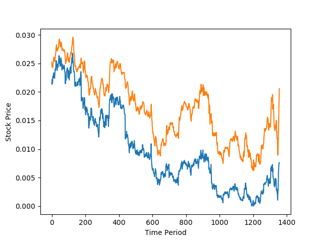
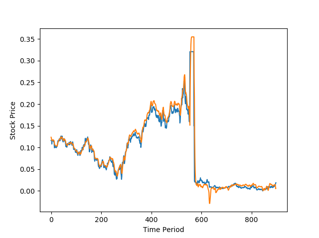
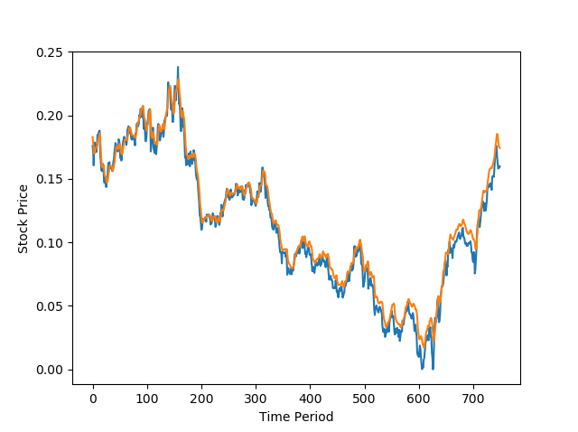
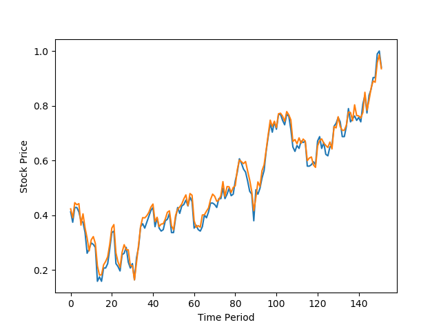

# Abstract

If you train with historical datas of the stock then you can predict its closed price.

# Prerequisites

* python3
* tensorflow
* pandas-datareader
* fix_yahoo_finance

# Install

```
pip install -r requirements.txt
```

# Usage

## Train

```bash
t.py 001040.KS 2018-05-06
```

download data and train and predict.

# Reseult

## 001040.KS

[001040.KS@yahoo](https://finance.yahoo.com/quote/001040.KS/chart?p=001040.KS)

```
seq_length = 7
data_dim = 5
hidden_dim = 10
output_dim = 1
learning_rate = 0.01
iterations = 500
```

| start date | end date | seq length | hidden dim | learning_rate | iterations | RMSE | img |
|:----------:|:----------:|:----------:|:----------:|:----------:|:----------:|:----------:|:----------:|
| 2000-05-06 | 2018-06-11 | 7 | 10 | 0.01 | 500 | 0.007609296590089798 |   |
| 2006-05-06 | 2018-06-11 | 7 | 10 | 0.01 | 500 | 0.008111413568258286 |   |
| 2008-05-06 | 2018-06-11 | 7 | 10 | 0.01 | 500 | 0.008038748987019062 |   |
| 2016-05-06 | 2018-06-11 | 7 | 10 | 0.01 | 500 | 0.02125178463757038 |   |
